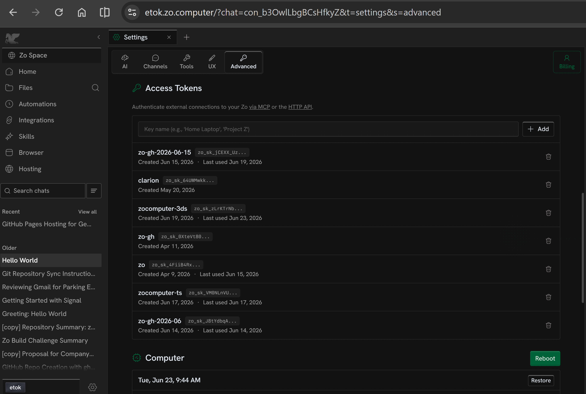
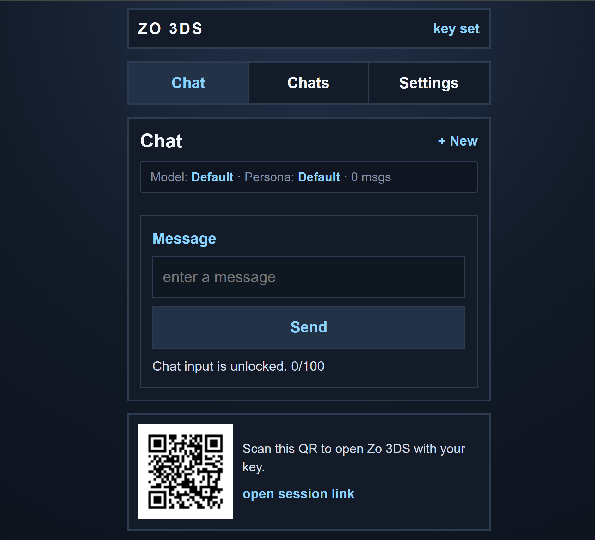

# zocomputer-3ds

Simplified demake of the Zo interface for the Nintendo 3DS browser.

## Goal

Keep the experience readable, fast, and friendly to 3DS browser limits.

## What this pass adds

- A stronger dashboard-style landing page
- Large tap targets and stacked sections
- Minimal ES3-safe JavaScript for chat gating and QR rendering
- Basic chat, task, and tools panels for the core Zo flow
- A clickable status bar that opens a QR session dialog
- ES3-safe browser JS that reads `?key=...` and builds a local QR SVG
- A fallback prompt for entering an API key before QR generation
- Playwright browser tests that verify the chat lock, QR flow, and URL key hydration

## Setup (3DS)

1. Get a Zo access token from <https://zo.computer> (your account settings). New to Zo? [Create a free account with $10 in AI credit](https://zo-computer.cello.so/fFG5xDTfXhY).
   
2. Open <http://zocomputer-3ds.etok.me/> on any device with a browser
3. Paste your API key into the prompt to generate a QR code
   
4. Open the 3DS Camera app and scan the QR code and it opens <http://zocomputer-3ds.etok.me/> in the 3DS browser
5. The key is stored locally so future visits skip the prompt

## Testing

```bash
npm test
```

## Development

Run the development server locally in watch mode:

```bash
npm run dev
```

## References

- `https://github.com/EthanThatOneKid/zocomputer-ts`
- `https://github.com/EthanThatOneKid/3ds-web-skills`
